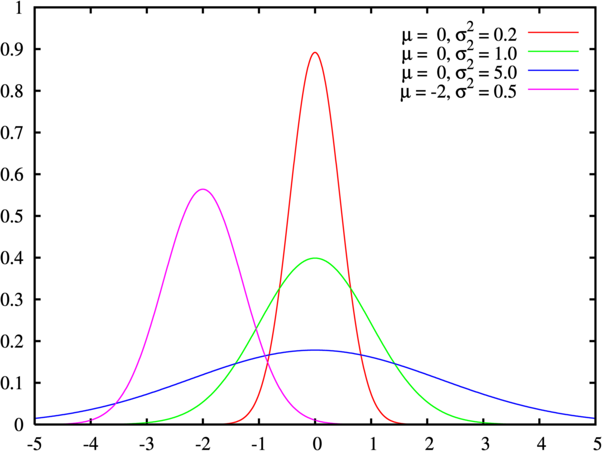
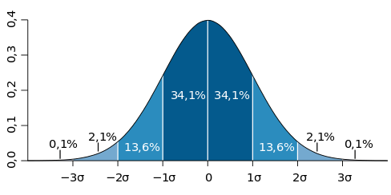
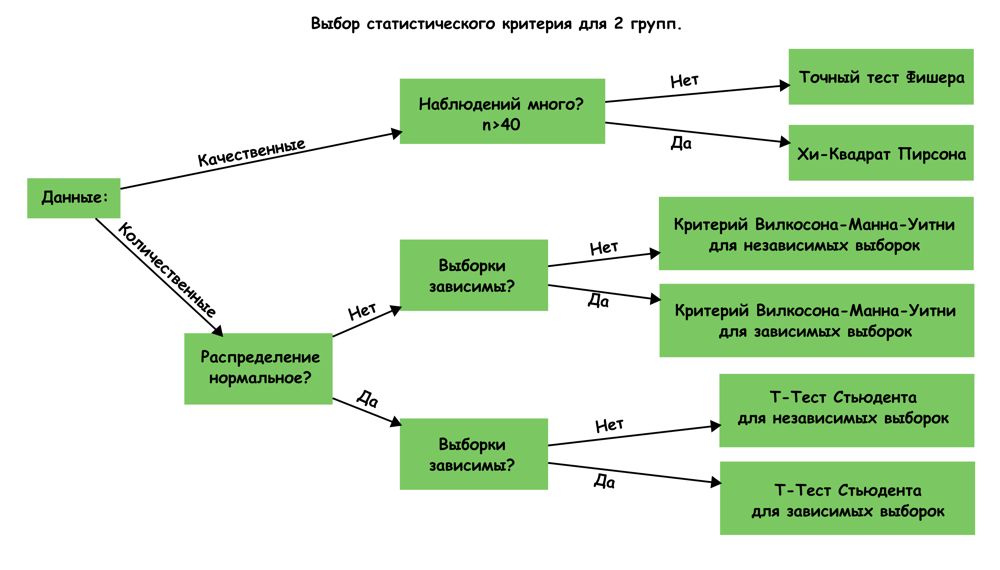

# Критерии {#kriterii }


В память о погибшем коде.

<details><summary> `press F` </summary> 

Делайте бекапы. Цените ваше время и силы.</details>

## Темы занятия

* Хи-квадрат Пирсона.
* Точный критерий Фишера.
* Проверка на нормальность и гомогенность дисперсий. (Графические методы, Вероятностная бумага, Критерии Шапиро–Уилка и Колмогорова–Смирнова.)
* Критерий Стьюдента (t.test).
* Критерий U-Манна-Уитни + Вилкоксон.

------------------------- 

Нам понадобятся:

```{r, eval=FALSE}
install.packages("ggplot2")
install.packages("car")
install.packages("nortest")

```

-------------------------

Используем датасет который предложил Иван Иванчей в моем любимом курсе по R https://stepik.org/course/129/syllabus

* `npersons` - сколько человек в планируемом проекте
* `years_in_uni` сколько лет провел в университете руководитель проекта
* `oldest_age` - самый старый сортудник
* `field` - облать исследования
* `status` - поддержана ли заявка
 
```{r} 
df <- read.csv("https://stepic.org/media/attachments/lesson/11502/grants.csv")
df$status <- factor(df$status, labels = c("Не поддержан","Поддержан")) 
table.status <- table(df$status) 
table.field <- table(df$status, df$field) 
table.field # поддержаные и неподдержаные заявки на грант в разных областях
```

## Хи квадрат 
>Критерий χ2 ("хи-квадрат", также "Критерий согласия Пирсона") - непараметрический метод, который позволяет оценить значимость различий между фактическим (выявленным в результате исследования) количеством исходов или качественных характеристик выборки, попадающих в каждую категорию, и теоретическим количеством, которое можно ожидать в изучаемых группах при справедливости нулевой гипотезы о отсутствии между ними различий.

### Требования 
Работает с категориальными переменными. На вход функции `chisq.test()` можно подать одномерную или двухмерную таблицу сопряженности. Использование возможно при n>40 (в идеале n>200).

### Ограничения 
Ожидаемые частоты не должны быть очень малы, так как критерий хи-квадрат проверяет вероятности в каждой ячейке, то если ожидаемые частоты в ячейках становятся меньше 5 (есть мнение что 10), то эти вероятности нельзя оценить с достаточной точностью с помощью имеющихся частот. Критерий χ2 ошибается на выборках с низкочастотными (редкими) событиями. Решить эту проблему можно отбросив низкочастотные события, либо объединив их с другими событиями. Этот способ называется коррекцией Йетса (Yates' correction).

### Пример использования

```{r}
chisq.test(table.status)

chi <- chisq.test(table.status)
chi$exp # ожидаемые значения (если бы поддержки заявок распределялись случайно и равномерно)
chi$obs # наблюдаемые значения
```

### Интерпритация
Нулевая гипотиза о равномерном распределении вероятностей поддержаных и неподдержаных грантов отвергается. Вероятность не получить поддержку заявки чуть выше.

Посмотрим как обстоит дело с поддержкой заявок по разным областям науки. Отхиквадратим двухмерную таблицу сопряженности.

```{r}
chisq.test(table.field)
```

Как можно видеть распределение поддержки заявок по разным областям различается на уровне тенденции, но гипотзу о том, что различий в поддержке заявок между областями нет мы отвернуть не можем. 

### Визуализация

```{r}
barplot(table.field, legend.text = TRUE, args.legend = list(x = "topright"), beside = TRUE)
mosaicplot(table.field)
```

**Опасная опасность!** Не используйте столбчатые диаграммы (barplot) для визуализации средних значений. Такие графики могут вводить в заблуждения. В них подразумевается нулевой уровень что не имеет отношения к средним значениям. Графики Barplot используются для счетных данных.

### Задание:
При помощи точного критерия согласия Пирсона проверьте гипотезу о различии в поддержке заявок (`status`) в зависимости от колличества лет, проведенных в университете руководителем проекта (`years_in_uni`). Какой p-уровень значимости?
<details><summary> Ответ </summary> 0.0787 </details> 

------------------------- 

## Точный тест Фишера
> Точный тест Фишера используется в анализе категориальных данных. Исследование значимости взаимосвязи между двумя переменными в факторной таблице размерности 2 x 2 для выборок маленьких размеров.  *Не путать с критерием Фишера (который сравнивает дисперсии двух независимых выборок.)*

Критерий основан на переборе всех возможных вариантов заполнения таблицы сопряженности при имеющейся численности групп. 

### Когда применяют?
При небольшом числе наблюдений. Но в наши дни необязательно - у нас есть **мощь R** чтобы проводить его на большом колличестве наблюдений.

### Требования 
Принимает на вход двухмерную таблицу сопряженности.

### Пример использования

```{r}
fisher.test(table.field)
```

### Задание: 
При помощи точного критерия Фишера проверьте гипотезу о взаимосвязи типа коробки передач (`am`) и типа двигателя (`vs`) в данных mtcars. Какой p-уровень значимости?
<details><summary> Ответ </summary> 0.4727 </details>

------------------------- 

## Проверка на нормальность
Величины, имеющие нормальное распределение, в реальных экспериментах
возникают совершенно естественным образом, При измерении любой характеристики всегда имеется ошибка измерения. Если предполагать, что ошибка прибора
имеет нормальное распределение, то среднее отвечает за систематическую ошибку, а дисперсия — за величину случайной ошибки.



График плотности вероятности нормального распределения и процент попадания случайной величины на отрезки, равные среднеквадратическому отклонению.


Некоторые критерии предпологают их использование только если выборка имеет нормальное распределение. Если это не так, то выводы, полученные на основе этих
критериев, будут ошибочными.

Что делать, если заранее известно, что выборки имеют другое распределение отличающееся от нормального? В таких случаях используются непараметрические критерии, т. е. свободные от предположения какой-либо параметрической модели данных. К сожалению, эти критерии оперируют гораздо меньшим «объёмом информации» и не смогут заметить такие тонкие различия, которые были бы обнаружены при использовании параметрических критериев, опирающихся на предположеие о нормальности распределения.

**Как понять нормально ли распределены данные?**
Можно оценить на глаз, построив гисторамму или график квантилей:

```{r}
library("car")

hist(rnorm(100)) # гистограмма нормального распределения выглядит примерно так

qqnorm(rnorm(100)) # встроенная функция для построения графика квантилей

qqPlot(rnorm(100)) # значения нормального распределения сильно не выходят за пунктирную линию и выстраиваются вдоль центральной линии


```

>Вероятностная бумага (диаграмма Вейбула) – это специальный бланк, разлинованный таким образом, что кумулятивная функция нормального закона на нем приближается к прямой линии. 

Если график на диаграмме представлен набором точек, которые рассеянны около прямой линии, то это позволяет предположить, что генеральная совокупность, из которой взята выборка, подчиняется нормальному закону распределения случайной величины. Если точки аппроксимируются в кривую линию, то распределение параметра X отличается от нормального и при этом можно оценить кривизну и асимметрию функции плотности распределения. 


Но прикидки на глаз обычно не столь хороши как статистические тесты, поэтому разберем некоторые из них.

Но сперва познакомимся с датасетом на котором дальше мы будем разбирать примеры - `iris`. Он описывает длинну и ширину лепестка и чашелистика 50 цветков ириса. 


```{r}
df1 <- subset(iris, Species != "setosa") # возьмем 2 вида цветков потому что для t-test нужнен групирующий фактор с 2 уровенями.
str(df1)
```

Посмотрим на форму распределения длинны чашелистика в зависимости от вида ириса:

```{r}
library("ggplot2")

hist(df1$Sepal.Length) # схематично, сбоку 

ggplot(df1, aes(Sepal.Length, fill = Species))+
  geom_density(alpha = 0.5) # информативно, сбоку

ggplot(df1, aes(Species, Sepal.Length))+
  geom_boxplot() # можно сказачать что взгляд сверху
```

------------------------- 

### Критерии Шапиро–Уилка 
Один из тестов которые проверяют происходит ли анаизируемая выборка из генеральной совокупности имеющей нормальное распределение является Критерии Шапиро–Уилка. Если получаемая при помощи того или иного теста вероятность ошибки Р оказывается меньше некоторого заранее принятого уровня значимости (например, 0.05), нулевая гипотеза отклоняется и мы отвергаем гипотезу о нормальности распределения.

```{r}
shapiro.test(df1$Sepal.Length) # p > 0.05 - нулевая гипотиза не отвергается, предпологаем что параметр распределен нормально.
```

Можно провести проверку на нормальность переменной в разных группах с помощью функции `by()`. Проверка на нормальность переменной Sepal.Length в трех разных группах в соответствии с переменной Species:

```{r}
by(iris$Sepal.Length, INDICES = iris$Species, shapiro.test) 
```

------------------------- 

### Критерий Колмогорова–Смирнова
Поскольку стандартный Критерий Колмагорова-Смирнова может проверять гипотизы соответствия выборки некоторому заданному закону распределения, при использовании его нужно указать с каким распределением проводится сравнение, среднее значение и стандартное отклоенение.

```{r}
mean(df1$Sepal.Length) # среднее для выборки
sd(df1$Sepal.Length) # стандартное отклонение
ks.test(df1$Sepal.Length, "pnorm", mean = 6.262, sd = 0.6628344) # не уверен что сюда нужно ставить реальные значния а не "теоретические". Пожалуйста, поправте меня.
```

Но лучше, если нам не известны мат. ожидание и дисперсия (а так оно обычно и есть),  использовать модификацию этого критерия - Критерий Лиллиефорса который реализован в пакете `nortest`.
```{r}
library("nortest")
lillie.test(df1$Sepal.Length)
```

### Проверка однородности (гомогенности) дисперсий.

Для проверки однородности дисперсий существует например Тест Бартлетта.
```{r}
bartlett.test(Sepal.Length ~ Species, df1)
```
Как видно по p-value дисперсии этих групп однородны.

При выявлении существенной неоднородности дисперсии возможны два решения: определенное преобразование исходных данных (например, логарифмирование) или использование моделей, допускающих неоднородность дисперсии.

------------------------- 

## Критерий Стьюдента (t-test)
>t-критерий Стьюдента — общее название для класса методов статистической проверки гипотез (статистических критериев), основанных на распределении Стьюдента. Наиболее частые случаи применения t-критерия связаны с проверкой равенства средних значений в двух выборках.

В одном случае его применяют для проверки гипотезы о равенстве генеральных средних двух независимых, несвязанных выборок (так называемый двухвыборочный t-критерий). В этом случае есть контрольная группа и экспериментальная (опытная) группа, количество испытуемых в группах может быть различно.

Во втором случае, когда одна и та же группа объектов порождает числовой материал для проверки гипотез о средних, используется так называемый парный t-критерий. Выборки при этом называют зависимыми, связанными.

### Метод реализации

Критерий позволяет найти вероятность того, что оба средних значения в выборке относятся к одной и той же совокупности. Данный критерий наиболее часто используется для проверки гипотезы: «Средние двух выборок относятся к одной и той же совокупности».

T-статистика строится обычно по следующему общему принципу: в числителе случайная величина с нулевым математическим ожиданием (при выполнении нулевой гипотезы), а в знаменателе — выборочное стандартное отклонение этой случайной величины, получаемое как квадратный корень из несмещённой оценки дисперсии.

### Требования 
1. Для применения данного критерия необходимо, чтобы исходные данные имели нормальное распределение. 
2. В случае применения двухвыборочного критерия для независимых выборок также необходимо соблюдение условия равенства дисперсий. 

### Ограничения 
Чувствителен к выборосам. Буквально пара сильных выбросов может убить весь p-value.

### Пример использования
Для Критерия Стьюдента с независимыми выборками на вход необходимо подать две переменные, одна колличественая а другая номенальная представленная в качестве фактора из двух уровенй.

```{r}
t.test(Sepal.Length ~ Species, df1)
1.866e-07 == 0.0000001866 # e-07 = умножение на 10 в минус 7 степени (добавили 6 нулей после запятой)
```

### Интерпритация: 
Так как p-уровень меньше 0.05 то мы можем отклонить нулевую гипотизу о равенстве средних. 

### Дополнительные параметры
Тип альтернативной гипотизы - односторонний или двухсторонний (`alternative`).
Тест для зависимых или независимых выборок (`paired`).
Выполняется ли условие гомогенности дисперсий (`var.equal = TRUE`); Или t-критерий в модификации Уэлча (Welch), свободный от этого предположения (`var.equal = FALSE`, по умолчанию).

Проведем одновыборочный t.test чтобы проверить сравнить "теоретическое среднее" с наблюдаемым.

```{r}
t.test(df1$Sepal.Length, mu = 8) # проверим равняется ли среднее в генеральной совокупности 8?
```

### Задание: 
C помощью Критерия Стьюдента проверьте на данных `df1` гипотизу что в генеральной совокупности средняя длинна чашелистика равняется 6.2. Какой p-value?
<details><summary> Ответ </summary> 0.3519 </details>

Критерий стьюдента можно применять для зависимых переменных. Для этого эти переменные должны быть колличественные и подаваться на вход как два отдельных вектора значений. Проверим что длинна и ширина чашелистика не равны.

```{r}
t.test(df1$Sepal.Length, df1$Sepal.Width, paired = TRUE) 
```

### Визуализация.
Чтобы отобразить на графике сравнение двух средних с доверительными интервалами можно применить `stat_summary()` добавленную к `ggplot`. Различия в средних и доверительных интервалах длины лепестка между двумя видами ирисов: 

```{r}
ggplot(df1, aes(Species, Sepal.Length))+
  stat_summary(fun.data = mean_cl_normal, geom = "pointrange", size = 2)# mean_cl_normal встроенная в ggplot функция подсчета среднего.
 
```

------------------------- 

## Критерий U-Манна-Уитни и Вилкоксона
>U-критерий Манна — Уитни — Уилкоксона (англ. Mann–Whitney U-test) — статистический критерий, используемый для оценки различий между двумя независимыми выборками по уровню какого-либо признака, измеренного количественно. Позволяет выявлять различия в значении параметра между малыми выборками.

Критерий переводит все данные в ранговую шкалу (уходит от реальных значений признака и ранжирует все показатели от первого до последнего наблюдения) а затем считает какой средний ранг оказался в первой группе, а какой во второй. 

Создатели системы R под названием "критерий Уилкоксона" (или "тест Уилкоксона") объединяют как собственно метод, предложенный Фрэнком Уилкоксоном (Frank Wilcoxon) в 1945 г., так и опубликованный несколько позднее (1947 г.) метод Манна-Уитни. Первый из этих методов обычно используется для сравнения двух связных выборок, тогда как второй предназначен для сравнения двух независимых выборок.

### Метод реализации
Для двух независимых выборок все имеющиеся значения ранжируют, игнорируя их знак;
Ранги значений, принадлежащих к первой группе, суммируют, получая величину W;
Полученное W сравнивают со значением, которое можно было бы ожидать при верной нулевой гипотезе и имеющемся числе степеней свободы; альтернативный подход - находят вероятность случайным образом получить значение W, равное или превышающее наблюдаемое значение (при условии истинности нулевой гипотезы).

Сравнение зависимых выборок выборок при помощи критерия Уилкоксона происходит сходно с тем, как это делается при помощи парного критерия Стьюдента. В частности, находят разницу между всеми имеющимися парными выборочными наблюдениями с целью проверить нулевую гипотезу о том, что медиана полученных разностей равна нулю (либо какому-либо другому, отличному от нуля значению).

### Когда используют? 
Если не выполняется одно из требований для критерия Стьюдента, не очень много данных или не очень нормальное распределение. Непараметрические аналог t.test. Гораздо менее чувствителен к выбросам чем критерий Стьюдента.

### Ограничения 
1. В каждой из выборок должно быть не менее 3 значений признака. Допускается, чтобы в одной выборке было два значения, но во второй тогда не менее пяти.
2. В выборочных данных не должно быть совпадающих значений (все числа — разные) или таких совпадений должно быть очень мало (до 10).
3. В каждой выборке должно быть не более 60 наблюдений;

### Пример использования
```{r}
wilcox.test(df1$Petal.Length ~ Species, df1)
```

### Интерпритация
Длинны лепестков между видами ирисов статистически значимо различаются.

Также как и для `t.test()` существует `wilcox.test()` для зависимых переменных. Форма записи такая же как в критерии Стьюдента.
```{r}
wilcox.test(df1$Petal.Length, df1$Petal.Width, paired = TRUE)
wilcox.test(df1$Petal.Length, df1$Petal.Width, conf.int = TRUE) # оценка различия в сдвиге между двумя выборками и доверительный интервал для него

```
Как видим эти характеристики лепестка не равны.

### Визуализация
Чтобы отобразить на графике сравнение двух средних с доверительными интервалами можно применить `stat_summary()` добавленную к `ggplot`. Различия в средних и доверительных интервалах длины лепестка между двумя видами ирисов: 

```{r}
ggplot(df1, aes(Species, Petal.Length))+
  geom_boxplot()
```

### Задание: 
Обьясните, почему мы по разному визуализируем данные Критерия Стьюдента и данные Критерия Вилкоксона-Манна-Утни?

## Выбор критерия: 



