# Первая лекция {#intro}

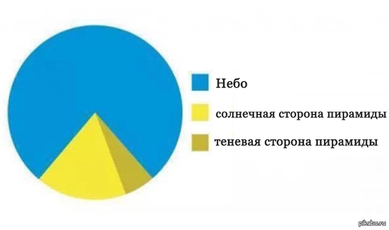  

## Темы занятий {#topics}

1. Частотные таблицы. Таблицы сопряженности. (Что такое частотные данные. Как строить таблицы сопряженности.)
2. Хи-квадрат и точный критерий Фишера. Проверка на нормальность и сравнение средних (Математика хи-квадрата. Требования. Точный критерий Фишера. Графические и аналитические методы. Вероятностная бумага. Критерии Шапиро–Уилка и Колмогорова–Смирнова. Параметрические и непараметрические критерии. t-тест, U-Манна-Уитни, Вилкоксон)

## Частотные данные {#chastot}

Частотные данные часто используются для описательных статистик. Это позволяет получить представление о структуре анализируемых данных в целом. 

Примеры будем разбирать на встроенном датасете R - `mtcars`: 
датасет с 32 автомобилями по 11 признакам, два из которых (`vs` и `am`) являются номинальными переменными (факторами) c уровнями, закодированными в виде 0 и 1 (подробнее см. `?mtcars`). `mpg` - топлевная экономичность (в милях на галон) запишем его в переменнную `df`.

```{r}
df <- mtcars
```

### Описательные статистики 
К описательным статистикам обычно относят характеристики центральной тенденции:

>**Медиана** - уровень показателя, который делит набор данных на две равные половины.

```{r}
median(df$mpg)
```

>**Арифметическое среднее** - сумма чисел, разделённая на их количество.

```{r}
mean(df$mpg)
```

>**Мода** - значение во множестве наблюдений, которое встречается наиболее часто.

Для моды стандартной команды в R не предусмотрено, можно использовать такую функцию:

```{r}
Modes <- function(x) {
  ux <- unique(x) # выделение уникальных значений в векторе
  tab <- tabulate(match(x, ux)) # подсчет сколько раз встречается значение
  ux[tab == max(tab)]
}

Modes(df$cyl)
```

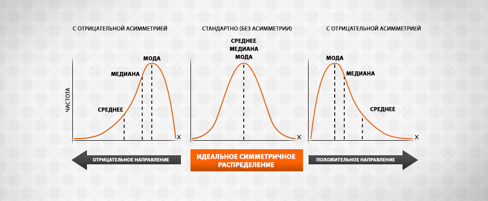  

также к К описательным статистикам относят показатели вариации (изменчивости) данных:

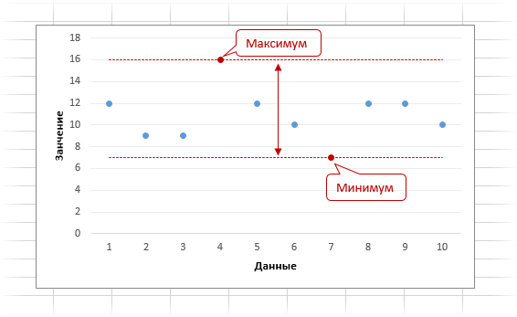  

>**Дисперсия** случайной величины – это один из основных показателей в статистике. Он отражает меру разброса данных вокруг арифметической средней.

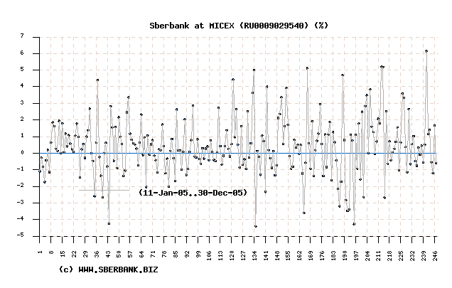

```{r}
var(df$mpg)
```

>**Стандартное отклонение** -  оценка стандартного отклонения ее выборочного распределения, приближенно показывает, насколько значение статистики может отличаться от своего среднего значения (параметра генеральной совокупности).

```{r}
sd(df$mpg) 
```

>**Стандартная ошибка** -  (или просто стандартная ошибка) приближенно показывает, насколько ее выборочная средняя  (случайная наблюдаемая величина) отличается от среднего генеральной совокупности.

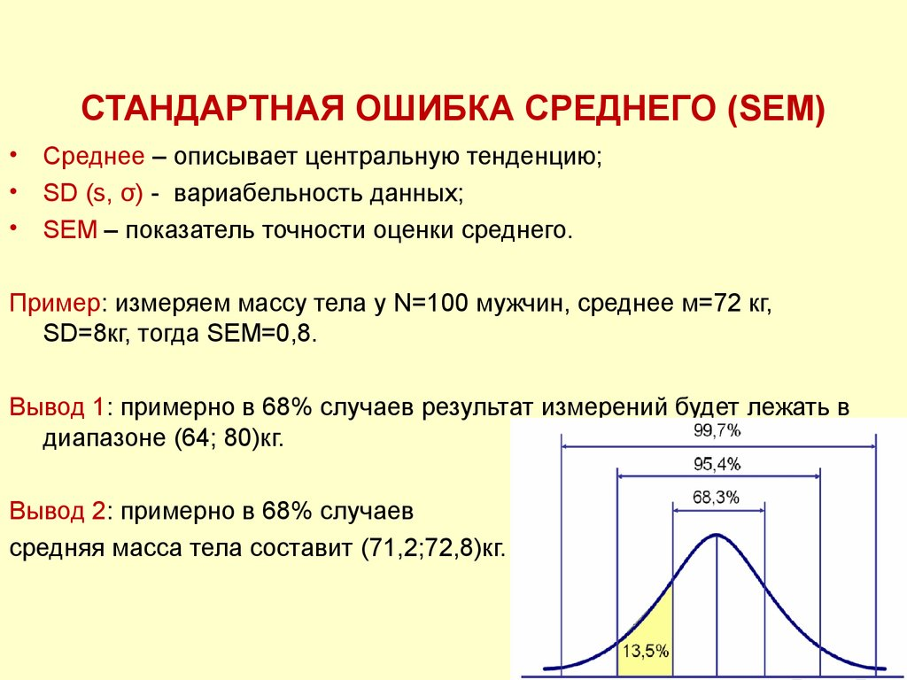 

Специальной функции для расчета стандартной ошибки среднего в R нет, однако для этого вполне подойдут уже имеющиеся функции. Как известно, стандартная ошибка средней рассчитывается как отношение стандартного отклонения (sd) к квадратному корню из объема выборки: 

```{r}
sd(df$mpg)/sqrt(length(df$mpg)) # функция length() возвращает число элементов в векторе mpg

```

Минимальное, максимальное значение и размах (оба значения).

```{r}
min(df$mpg)
max(df$mpg)
range(df$mpg)
```

Можно посмотреть многие эти характеристики (если они применимы к шкале) с помощью функции `summary()`.

```{r}
summary(df)  
```

В статистике данные очень часто группируют в соответствии с тем или иным признаком, например, полом, социальным положением, стадией болезни, местом отбора проб и т.п. В R существует специальный класс векторов - факторы (factors), которые предназначены для хранения кодов соответствующих уровней номинальных признаков.Часто уровни факторов кодируют в виде чисел.

Если что факторные переменные закодированы при помощи чисел 0 и 1, то для корреткной работы нужно их преобразовать в факторы. 

например переменная `df$vs` указана как numeric.
```{r}
class(df$vs) 
```

Это может приводить к некоректной работе. Наример плот неправильно строит граф потому что неверно воспринимает тип переменной.

```{r}
plot(df$vs) 
```

Изменим тип переменной в факторы.

```{r}
df$vs <- as.factor(df$vs) # теперь summary(df$vs) отображается корректно
plot(df$vs)
```

Или их можно переименовать сделав факторами в соответсвии с типом двигателя (V или S образный тип).

```{r}
df$vs <- factor(df$vs, labels = c("V", "S")) 
```

и по коробке передач (автоматическая или механическая).

```{r}
df$am <- factor(df$am, labels = c("auto", "manual"))
summary(df$am)
```
```{r}
plot(df$am)
```

Также можно вставлять логические условия для обращения к некоторым элементам

```{r}
mean(df$mpg[df$cyl == 6 & df$vs == "V"]) # те элементы у количество цилиндров = 6 и V-обтразный двигатель)
```

`NA` в переменной будет мешать посчитать некоторые статистики (например среднее значение)

```{r}
df$mpg[3] <- NA
head(df$mpg)
mean(df$mpg)
```

Можно пропускать отсутсвующие значения опцией na.rm (от not available и remove - удалить)

```{r}
mean(df$mpg, na.rm = TRUE) 
```

Количество всех значений можно посчитать через 

```{r}
length(df$mpg) # считаются значения включая NA
```

Количество неотсутствующих значений можно посчитать вот так:

```{r}
sum(!is.na(df$mpg)) 
```

А количество отсутстствующих вот так: 

```{r}
sum(is.na(df$mpg))
```

вернем значение на место 

```{r}
df$mpg[3] <- mtcars$mpg[3] 
```

Выяснить порядковые номера элементов, обладающих минимальным и максимальным значениями.

```{r}
which.min(df$mpg) 
which.max(df$mpg) 
```

Не бойтесь использовать функции при индексации и в других функциях:

```{r}
rownames(df)[which.min(df$mpg)]
```

Описательные статистики можно также выполнять функцией aggregate()

```{r}
aggregate(x = df$mpg, by = list(df$vs), FUN = mean) # лист группирующих переменных

aggregate(hp ~ vs, df, mean) # упрощенная запись 

aggregate(hp ~ vs + am, df, mean) # Можно разбивать по нескольким группам.
```

А также функцией `tapply()`. 
Эта функция относится к "apply-семейству" R-функций. Эти функции позволяют выполнять математические вычисления над определенными элементами таблиц данных, матриц, или массивов (например, быстро вычислять среднее значение для каждого столбца или строки таблицы, и т.п.).

```{r}
tapply(X = df$mpg, INDEX = df$am, FUN = Modes) # считает моду топливной экономичности по факторам коробки передач 
```

Подсчет среднего топливной экономичности по факторам коробки передач и типу двигателя.

```{r}
tapply(X = df$mpg, INDEX = list(df$am, df$vs), FUN = mean)
```

В параметр FUN можно вставлять пользовательские функции, например написаную вручную функцию для стандратных ошибок.

```{r}
SE <- function(x) {sd(x)/sqrt(length(x))}
```

Вставляем в FUN и все работает.

```{r}
tapply(X = df$disp, INDEX = df$am, FUN = SE)
```

### Показатели вариации {#variation}

Показатели вариации дают очень важную характеристику процессам и явлениям. Они отражают устойчивость процессов и однородность явлений. Чем меньше показатель вариации, тем более процесс устойчивый, а значит, и более предсказуемый.

>**Квантили** - общий термин для порогового значения не выше которого (то есть равно или ниже) которого лежит указанная часть данных. Медиана делит распределение попалам. Квартили делят распределение на четверти, квинтили - на 5 частей, децили - на 10 частей и процентили - на 100.

Например, первый квартиль (Q1) делит распределение так, что 25 процентов наблюдений лежат не выше него; следовательно, 1-й квартиль также является 25-м процентилем.
Второй квартиль (Q2) представляет 50-й процентиль, а третий квартиль (Q3) представляет 75-й процентиль, потому что 75 процентов наблюдений лежат не выше него.

```{r}
quantile(df$mpg)
```

При настройках, заданных по умолчанию, выполнение указанной команды приведет к расчету минимального (10.4) и максимального (33.9) значений, а также трех квартилей, т.е. значений, которые делят совокупность на четыре равные части - 15.4, 19.2 и 22.8. Межквартильный размах - это разница между 1-м и 3-м квартилями, т.е. между 25-м и 75-м процентилями. А разница между первым и третьим квартилями носит название интерквартильный размах (ИКР; англ. interquartile range). 

ИКР является робастным (выборосоустойчивый) аналогом дисперсии и может быть рассчитан в R при помощи функции `IQR()`:

```{r}
IQR(df$mpg)
```

Функция `quantile()` позволяет рассчитать и другие квантили. Например, децили (т.е. значения, делящие совокупность на десять частей) можно получить следующим образом:

```{r}
quantile(df$mpg, p = seq(0, 1, 0.1)) # задан вектор чисел от 0 до 1 с шагом в 0.1 = 10 квартилей
```

>**Межквартильный размах** - это разница между 1-м и 3-м квартилями, т.е. между 25-м и 75-м процентилями. Разница между первым и третьим квартилями носит название интерквартильный размах.

Наглядное отображение размаха вариации и межквартильного расстояния производят с помощью диаграммы «ящик с усами».

```{r}
boxplot(df$mpg)
```

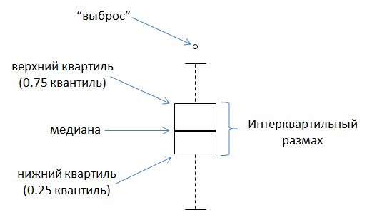 

Для подсчета кооффициента вариации и ассиметрии существует пакет moments (функции `kurtosis()` и `skewness()`)

```{r, eval = FALSE}
install.packages("moments")
```
```{r}
library(moments)
```

>**Коэффициент вариации** или эксцесс (Kurtosis) - (среднеквадратическое отклонение деленное на среднее и умноженное на 100%). Этот показатель, который отражает остроту вершины и толщину хвостов одномерного распределения.

Коэффициент вариации близок к 3 если наблюдения подчиняются нормальному распределению. Если коэффициент вариации значительно отличается от 3, то гипотезу о том, что данные взяты из нормально распределенной генеральной совокупности, следует отвергнуть. (НАСКОЛЬКО БОЛЬШЕ?)

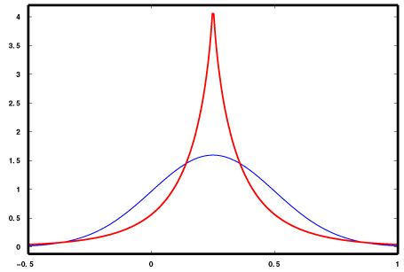 

>(Синяя кривая – нормальное распределение (куртозис нормального распределения вне зависимости от математического ожидания и стандартного отклонения равен 3).
Красная кривая – имеет положительный эксцесс/куртозис больше 3.)

```{r}
set.seed(42) # устанавливает seed (семечко) чтобы последующий псевдослучайный процесс можно было вопроизвести 
kurtosis(rnorm(1000))
```

>**Коэффициент асимметрии** - величина, характеризующая асимметрию распределения данной случайной величины. Положителен если правый хвост распределения длиннее левого. 

```{r}
skewness(df$mpg, na.rm = TRUE)# считая пропущенные значения
```

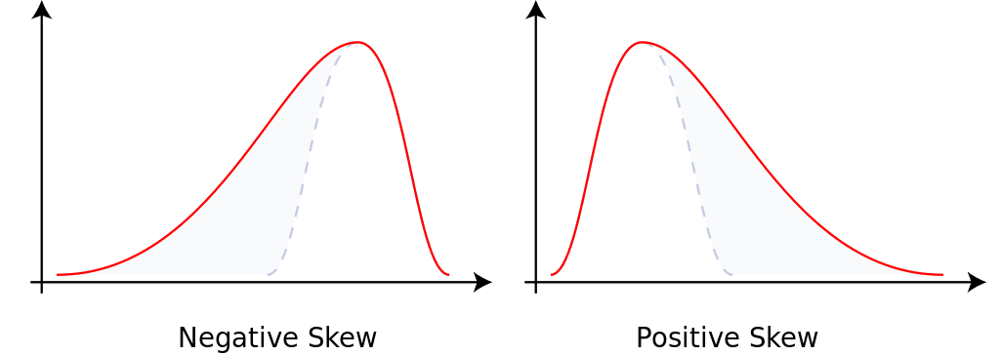  

## Частотный анализ для разных шкал измерений {#shcaly}

Если вчера было 2 градусов по Цельсию а сегодня 4 градуса, значит ли это что сегодня в два раза теплее? (Ответ станет понятен в процессе.)

### Неметрические шкалы: наименований и ранговая.
Доступны непараметрические методы статистики. В **шкале наименований** (номенальной) числа используются лишь как метки, для различения обьектов. 
Примеры: тип двигателя (V образный и S образный), пол, расса. 
Допустимые операции: проверка совпадания несовпадения (тождественность)`(a==b,a!=b)`.
Возможные описательные статистики: частота, мода.

```{r}
df$vs[1] == df$vs[2] # обе машины имеют V образный двиатель 
df$vs[1] == df$vs[3] # а эти имеют разные типы двигателей
```

В **порядковой шкале** (или ранговой) объекты ранжированы, расположены в порядке увеличения или уменьшения значения параметра.
Примеры: бальные оценки успеваемости (неудовлетворительно, удовлетворительно, хорошо, отлично).
Допустимые операции: проверка тождественности `(a==b,a!=b)`, сравнения `(a>b, a<b)`.
Упорядочим машины по параметру "Приятность названия машины Григорию" (где 1 самая приятная)

```{r}
df$like <- c(16,15,6,5,13,12,27,27,27,27,27,27,14,17,3,10,11,18,9,25,24,7,23,22,26,2,1,9,8,19,20,21)
```

Одинаково ли Григорию нравятся название машин "Merc 240D" и Merc 230?

```{r}
df["Merc 230", "like"] == df["Merc 240D", "like"] # да, одинаково
```

А какое название приятнее "Porsche 914-2" или "Chrysler Imperial"?

```{r}
df["Porsche 914-2", "like"] < df["Chrysler Imperial", "like"] # "Porsche 914-2" имеет более высокий ранг.
```

Возможные описательные статистики: мода, медиана.
Допустимые статистики: ранговые коэффициенты корреляции (r-Спирмана, r-Кендалла)

### Метрические шкалы: интервальная и абсолютная.

*Доступные параметрические методы статистики.*
В **шкале интервалов** существенной характеристикой является разность меджу значеними оцениваемых параметров выраженная в единицах этой шкалы. Начало отсчета может быть установлено произвольно.

*Примеры:* шкала Цельсия. Интервал между замерзанием и кипением воды разделен на 100 равных частей названых градусами.

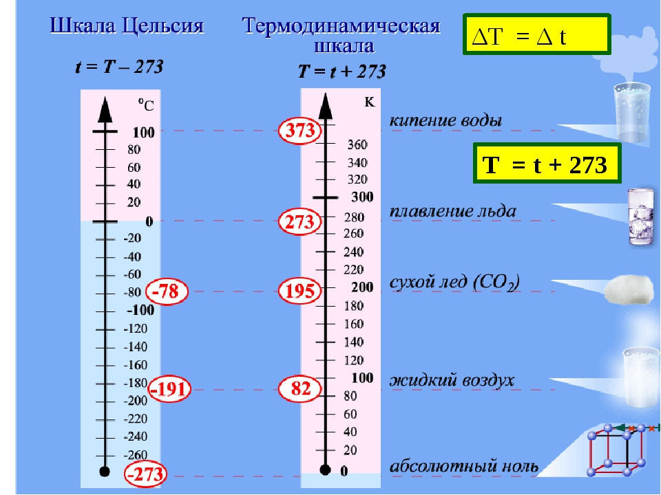  

**Допустимые операции:** проверка тождественности `(a==b,a!=b)`, сравнения `(a>b, a<b)`, сложения/вычетания `(a+b, a-b)`.

Ответ на вопрос в начале: Так как действия умножения и деления недоступны для интервальной шкалы, то неправомерно говорить во сколько раз одна температура больше другой.

*Возможные описательные статистики:* мода, медиана, среднее арефметическое, стандартное отклонение.

*Допустимые статистики:* критерий согласия Пирсона, R —	множественный коэффициент корреляции, все известные операции с натуральными числами.


**Шкала отношений** (абсолютная шкала) - это шкала интервалов у которой определено нулевой элемент - начало отсчета, а также размер едениц измерения.

*Примеры:* длинна, стоимость, возраст.

*Допустимые операции:* проверка тождественности `(a==b,a!=b)`, сравнения `(a>b, a<b)`, сложения/вычетания `(a+b, a-b)`, умножения и деления `(a*b, a/b)`.

*Возможные описательные статистики:* мода, медиана, среднее арефметическое, дисперсия, стандартное отклонение, коэффициент вариации, геометрическое среднее (перемножаем числа и делим на их колличество).

*Допустимые статистики:* критерий согласия Пирсона, R —	множественный коэффициент корреляции, все известные операции с натуральными числами.

Как правило, для переменных, относящихся к метрической (интервальной) шкале и подчиняющихся нормальному распределению, в качестве основной характеристики используют среднее значение, а в качестве меры разброса – стандартное отклонение или стандартную ошибку. Для порядковых или интервальных переменных, не подчиняющихся нормальному распределению, соответственно медиану или первый и третий квартили. Для переменных, относящихся к номинальной шкале, нельзя дать других значимых характеристиккроме моды. 


## Построение таблиц сопряженности. {#table}

Таблицы сопряжённости (contigency tables) — это удобный способ изображения категориальных переменных и исследования зависимостей между ними. 

Таблица сопряжённости представляет собой таблицу, ячейки которой индексируются градациями участвующих факторов, а числовое значение ячейки — количество наблюдений с данными градациями факторов.

Для чего создаются таблицы сопряженности?

1. Показывают совместное распределение переменных в номинальной и порядковой шкале 
2. Проверка значимых различий между наблюдаемыми и ожидаемыми частотами
3. Выявляют наличие (отсутствие) взаимосвязи между переменными

При анализе таблиц сопряженности выявляются статистические закономерности, но не причинно-следственные. 

> О.Генри: «Почему дует ветер? – Потому что деревья качаются».

Характер отношений между двумя переменными наглядно можно представить разными
способами:

1. В случае измерения признаков в номинальной или порядковой шкале возможные
комбинации значений обеих переменных упорядочиваются в форме таблицы
сопряженности, при этом значения одной переменной образуют строки, а значения
другой — столбцы таблицы. 

2. После этого определяется частота появления всех возможных комбинаций обоих
признаков в собранных данных и значение ее заносится в ячейки, стоящие на
пересечении соответствующих строк и столбцов.

Для количественных данных, а также порядковых переменных с очень большим числом вариаций исходные значения предварительно группируются, соседние значения объединяются в небольшое число интервалов.

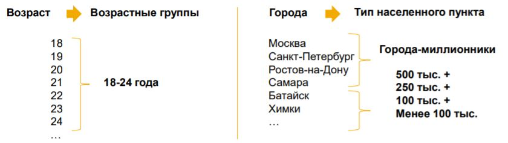 

Построить таблицу сопряжённости можно с помощью функции `table()`. В качестве аргументов ей нужно передать факторы, на основе которых будет строиться таблица сопряжённости:

```{r}
# таблица сопряженности для выборки имеющей распределение Пуассона (n=100, λ = 5)
table(rpois(100,5)) 
```
R использует «честное» представление для трёх- и более мерных таблиц сопряжённости, то есть каждый фактор получает по своему измерению. Однако,
это не очень удобно при выводе подобных таблиц на печать или сравнении с таблицами в литературе. Традиционно для этого используются «плоские» таблицы
сопряжённости, когда все факторы, кроме одного, объединяются в один «многомерный» фактор и именно градации такого фактора используются при построении таблицы сопряжённости. Построить плоскую таблицу сопряжённости можно с помощью функцией `ftable()`:

```{r}
table(Titanic)
```
```{r}
# Плоская таблица сопряженности для таблицы титаника
a <- ftable(Titanic, row.vars = 1:3)
```
```{r}
# графическое изображение таблицы сопряженности
plot(Titanic, main = "Survival on the Titanic", color = TRUE) # mosaicplot 

```

Опция `row.vars` позволяет указать номера переменных в наборе данных, которые следует объединить в один единый фактор, градации которого и будут
индексировать строки таблицы сопряжённости. Опция `col.vars` проделывает то
же самое, но для столбцов таблицы.

Функцию `table()` можно использовать и для других целей. Например подсчёта частот. Также можно считать пропуски:

```{r}
d <- factor(rep(c("A","B","C"), 10), levels=c("A","B","C","D","E"))
is.na(d) <- 3:4 # делаем пару значений NA
table(factor(d, exclude = NULL)) # exclude = NULL устанавливает NA как дополнительный фактор 

```


Задание создать такую таблицу сопряженности: 

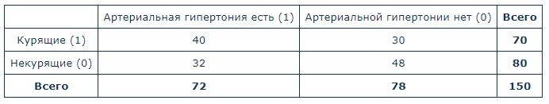


```{r}

# таблицу сопряженности в дата фрейме

lable <- c("Курящие","Не курящие", "Всего")
gipertonia_yes <- c(40, 32, 72)
gipertonia_no <-  c(30, 48, 78)
all <- c(70,80, 150)
gip <- data.frame(lable, gipertonia_yes, gipertonia_no, all)
str(gip)

```
 
 

Домашнее задание:

1. Выполнить 5.12 "Описательная статистика"
https://pozdniakov.github.io/stats/tasks.html#task_desc
2. Понять как работает table (посмотрите хелп)


